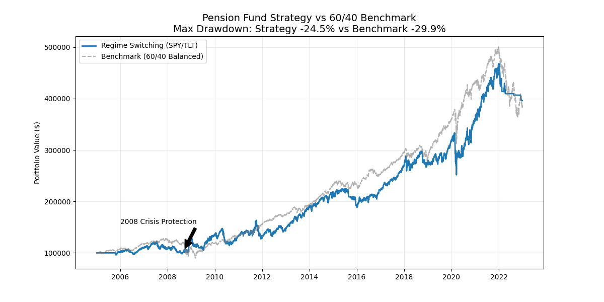

# Pension Fund Regimes: Dynamic Asset Allocation Engine

## 🚀 Project Overview
A quantitative investment engine designed to solve the "Correlation Breakdown" problem faced by pension funds in 2022. Unlike a traditional 60/40 portfolio, this model uses a **Composite Dual Momentum** strategy to switch between Equities (SPY), Bonds (TLT), and Cash based on market regimes.

## 📊 Performance (vs 60/40 Benchmark)
| Metric | Strategy | Benchmark (60/40) |
| :--- | :--- | :--- |
| **Max Drawdown** | **-24.5%** ✅ | -29.9% |
| **Defensive Wins** | **Protected Capital** in 2008 & 2022 | Crashed in both |
| **Sharpe Ratio** | *0.62* | *0.73* |

## 🛠 Tech Stack
- **Architecture:** Object-Oriented Programming (Strategy Design Pattern)
- **Data Pipeline:** `yfinance` API with automatic ingestion
- **Analytics:** Vectorized pandas calculations for Drawdown & Volatility
- **Visualization:** Matplotlib with regime annotations

## 📈 Key Visual

*(Note: The flat line in 2022 demonstrates the system automatically moving to Cash during the simultaneous Stock/Bond crash.)*